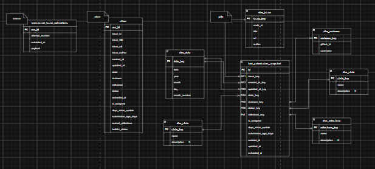
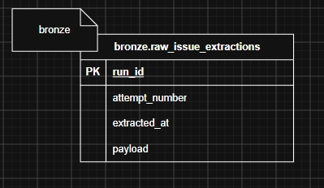
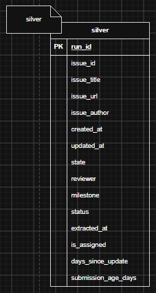
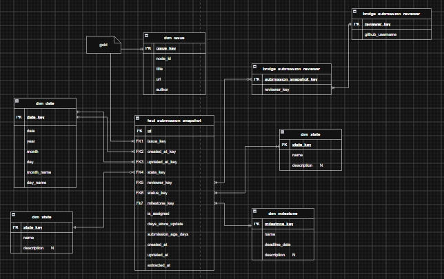

# DEP Open Track Submission Pipeline
### Background
This year the Data Engineering Pilipinas has held its Open Track Program where they have accepted 50 builders to learn the basics of data engineering. 

The tracking of the builders, however, poses a challenge where it is difficult to see where milestones a builder is in or how they are doing which inspires this data pipeline.

---
### Data Model/Architecture
This pipeline follows the medallion architecture with:
- **Bronze**: raw data
- **Silver**: cleaned and validated data
- **Gold**: Modeled data

  

**Bronze** contains the raw extractions and the metadata needed to be true to the source and allow reruns:

  

**Silver** contains the cleaned, validated, and derived data needed for analysis:

  

**Gold** contains a modeled schema for easier query. In addition this Gold architecture follows the **Kimball Model**.

- **Grain**
In Kimball architecture, after business alignment with the project's goals, the developer should go right into definition of the grain and that is what a row in a table represents.

For this project:
> One row represents the state of one submission as observed during one pipeline extraction.

Given the grain the uniqueness rule should be:

- `UNIQUE(issue_id, extracted_at)`
- The fact table also falls under the `periodic snapshot fact table`

Only after this definition, the developer should go after `dimensions` and `measurements/facts`:

  

---
### Analysis
I am interested in answering the following questions which will be translated to visualizations:

1. How are submissions distributed across milestones and statuses?
   - A stacked bar chart with milestones on the x-axis, submission count on the y-axis, and submission status as the stacks.
2. How many builders are on track or delayed?
   - KPI cards showing the count and percentage of unique builders in each group.
3. How does builder progress change over time?
   - A line chart with extraction date on the x-axis and average milestone completion rate on the y-axis.
   - A churn-risk metric can later represent builders with no milestone progress or submission activity for an agreed period.
4. Which builders need intervention?
   - A table showing each builder's current milestone, status, reviewer, issue state, submission age, and next action.
5. How much unresolved work does each reviewer have?
   - A horizontal bar chart showing the number of unresolved submissions assigned to each reviewer.
